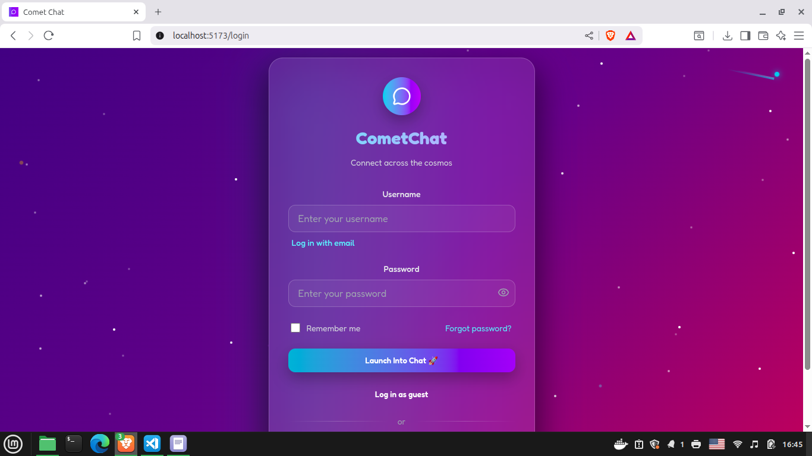

# Comet Chat

**Comet Chat** is a real-time messaging web application that allows users to **register, search for other users, and exchange messages** in a clean, modern interface.

Built as a full-stack project using **React**, **Express**, **Prisma**, and **PostgreSQL**, it demonstrates end-to-end development skills — from user authentication to database design and API integration.

## Features

- User Registration & Login — secure authentication with JWT tokens.

- Search Users — find other registered users by name or username.

- Direct Messaging — send and receive messages in real time.

- Profile Management — users can update their personal information directly from their profile page.

- Persistent Conversations — all messages are stored in a PostgreSQL database via Prisma ORM.

- Dark Mode — implemented through React Context for global state management.

## Tech Stack

- Frontend: React (Vite)

- Backend: Node.js + Express

- Database: PostgreSQL with Prisma ORM

- Authentication: JSON Web Tokens (JWT)

## Installation

1. Clone the repository:

   ```bash
   git clone https://github.com/hquezada24/cometchat.git
   cd cometchat
   ```

1. Install dependencies:

   ```bash
   npm install
   ```

1. Start the development server:

   ```bash
   npm run dev
   ```

1. Open in your browser: [http://localhost:5473](http://localhost:5473)

## Live Demo

## Screenshots




## Contact

Created by [Hugo Quezada](https://www.linkedin.com/in/hugo-quezada-7059091b6/)
